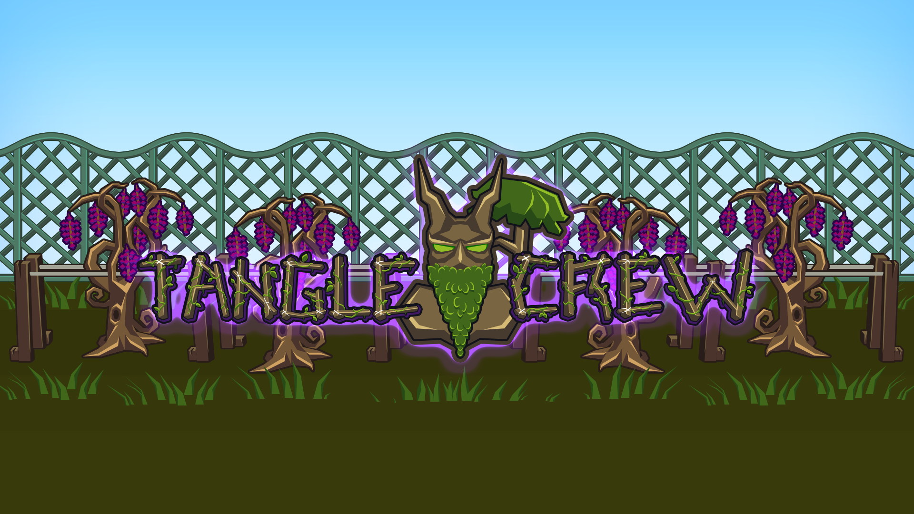

# Tanglebot

A Discord bot built for the **Tangle Crew** clan in [Old School RuneScape](https://oldschool.runescape.com/).

> **This bot was built with the assistance of [Claude](https://claude.ai/) by Anthropic — an AI coding assistant that helped design, write, debug, and iterate on all of the features described below.**

---

## Tangle Crew

| | |
|---|---|
| **Discord** | [https://discord.gg/tanglecrew](https://discord.gg/tanglecrew) |
| **Wise Old Man** | [wiseoldman.net/groups/12447](https://wiseoldman.net/groups/12447) |
| **OSRS Clan Finder** | [https://osrsclanfinder.com/clans/tangle-crew](https://osrsclanfinder.com/clans/tangle-crew) |

---

## Commands

### 🎡 `/spinwheel` — Prize Wheel

Spins an animated prize wheel and picks one or more random winners from a list of entries.

**When to use it:**
- Giveaways (pick a winner from everyone who entered)
- Loot splits (randomly assign a drop from a boss trip)
- Event prizes (randomly select who gets first pick of a reward)
- Deciding activities (spin between bossing locations, minigames, or skilling tasks)
- Any situation where you want a fair, visible, and fun random pick

**Options:**

| Option | Required | Description |
|--------|----------|-------------|
| `entries` | Yes | Comma-separated list of names or numeric ranges, e.g. `Alice,Bob,Carol` or `1-10` or `Alice,1-5,Bob` |
| `title` | No | Label shown on the wheel (default: `Wheel Spin`) |
| `winners` | No | How many winners to pick (1–10, default: 1) |
| `message` | No | Custom win message — use `{winner}` as a placeholder (default: `Winner is {winner}`) |
| `shuffle` | No | Shuffle the entry order before spinning (default: false) |
| `ping` | No | Send an `@here` or `@everyone` notification when the winner is announced |

**Range auto-fill:** Entries like `1-10` automatically expand to `1,2,3,4,5,6,7,8,9,10`. Works with any range in either direction (e.g. `5-1` counts down).

**How it works:**
1. The bot renders and sends an animated GIF of the wheel spinning, easing to a stop on the winner's slice.
2. Once the GIF finishes playing, the bot edits the same message to reveal the winner alongside the full entry list.
3. If a ping option was selected, a short follow-up is sent so Discord fires the notification.

---

### 💰 `/updatedonations` — Donation Leaderboard

Posts (or updates) a leaderboard message ranking clan members by total donations, and assigns donation tier roles based on configurable GP thresholds.

**When to use it:**
- Keeping a live, up-to-date donation leaderboard pinned in a channel
- Automatically granting/revoking donation tier roles as totals change

**How it works:**
1. Downloads the donation spreadsheet from the configured Google Sheets URL.
2. Reads the `Name`, `DiscordID`, and `Donated` columns. Rows with the same Discord ID are merged together (their totals are summed) before ranking.
3. Sorts donors by total donated, highest first.
4. For each donor, assigns the highest donation tier role they qualify for, plus every tier role below it (tiers stack — a Zenyte donor also keeps Gold and Diamond). Roles for tiers no longer met are removed.
5. Builds a leaderboard message with a 💰 "Donation High Scores" header, a total donated line, and one line per donor with their tier emoji, mention, and formatted total (e.g. `150M`, `77.5M`, `14,666K`). The top donor's name is shown enlarged.
6. Posts the leaderboard to the configured channel, or edits the existing leaderboard message(s) in place on subsequent runs (no duplicates). If the leaderboard is too long for one message, it's split across multiple messages, which are also kept in sync on later runs.

Restricted to users with the **Templar** role.

**Setup:**

1. Create a Google Sheet with `Name`, `DiscordID`, and `Donated` columns (see `Tanglebot/example/donations_template.xlsx` for the expected format). `Donated` accepts plain numbers or shorthand like `150M`, `75m`, or `300,000,000`.
2. Share the sheet: **Share → Anyone with the link → Viewer**.
3. Set `DONATIONS_SHEET_URL` to the sheet's URL (any Google Sheets link format works — edit, share, or export links are all normalised automatically).
4. Set `DONATIONS_CHANNEL_ID` to the channel where the leaderboard should be posted.
5. Optionally set `DONATION_GOLD_THRESHOLD`, `DONATION_DIAMOND_THRESHOLD`, and `DONATION_ZENYTE_THRESHOLD` (defaults: 75M / 150M / 300M).
6. Optionally set `DONATION_GOLD_ROLE_ID`, `DONATION_DIAMOND_ROLE_ID`, and `DONATION_ZENYTE_ROLE_ID` to have the bot manage tier roles. Leave a tier's role ID blank to skip role management for that tier.
7. Optionally set `DONATION_EMOJI_GOLD`, `DONATION_EMOJI_DIAMOND`, `DONATION_EMOJI_ZENYTE`, and `DONATION_EMOJI_COINS` to custom emoji IDs for the tier badges and the total donated line.

> **Note:** For role management to work, the bot needs the **Manage Roles** permission and its highest role must be positioned **above** the donation tier roles in Server Settings → Roles.

This command is only loaded if `DONATIONS_SHEET_URL` and `DONATIONS_CHANNEL_ID` are set.

---

### 🧾 `/submission` — Proof Submission Help

Posts the accepted KC/drop proof formats or shows the latest accepted proof submission.

**Subcommands:**

| Subcommand | Description |
|------------|-------------|
| `format` | Posts the KC and drop proof formats for players |
| `last` | Shows the latest accepted KC or drop proof submission |
| `showintakeurl` | Shows the current Discord KC intake URL the bot will use |
| `setintakeurl` | Stores a local override for the Discord KC intake URL |

`format` and `last` support a `private` option to show the response only to the person running the command. By default, responses are public so staff can post the format directly in a submission channel.

`showintakeurl` and `setintakeurl` are admin-only and reply ephemerally. `setintakeurl` writes a local override file on the bot so the intake endpoint can be changed without editing `.env` or restarting the process.

### `/channelmap` — Show Channel ID

The command replies ephemerally with:
- the channel mention and ID
- the value to paste into `event_discord_channels.channel_id`
- a reminder that routing now comes from the web panel / Supabase channel row

---

## Message Features

### KC and Drop Proof Intake

When configured, Tanglebot accepts KC and drop proof posts automatically in any Discord channel that is linked to an event through Supabase. The bot resolves the event by querying `event_discord_channels` for rows where `channel_kind = submission` and `channel_id` matches the Discord channel, caches the result briefly, and ignores channels with no configured event. Valid submissions are forwarded to the configured Supabase intake endpoint for manual review on the site without requiring a slash command first.

Supported KC format:

```text
Task name on Board: <tile title>
Monster being Killed: <monster name>
Starting or Ending: Starting
Starting Kill Count: 1234
```

Supported drop format:

```text
Task name on Board: <tile title>
Item Dropped: <item name>
```

Each submission must include exactly one image attachment. For ending KC submissions, `Starting or Ending: Ending`, `Ending Kill Count: 1234`, or `Kill Count: 1234` are accepted.

Messages in configured submission channels are only treated as submission attempts when they contain an image attachment or recognizable proof fields, so ordinary chatter is ignored. Validation failures ask the user to resubmit using the required format. If the Supabase channel lookup fails, the bot logs the error and asks the user to retry instead of crashing. The intake stays disabled unless all four intake environment variables are set, so existing slash-command functionality can run without site integration configured.

---

### Announcement Channel Cleanup

When configured, Tanglebot watches a designated announcement channel and automatically deletes any crossposted message that Discord has replaced with `[Original Message Deleted]`. This happens when a server follows an external announcement channel and the original post is later removed — Discord edits the local copy to show that placeholder rather than removing it. Tanglebot detects that edit and cleans it up immediately.

Set `ANNOUNCEMENT_CHANNEL_ID` to the ID of the channel where cleanup should run. Leave it blank to disable.

> **Note:** The bot needs the **Manage Messages** permission in the configured channel.

---

## Setup

### Prerequisites

- [Node.js](https://nodejs.org/) v18 or later
- A Discord bot token and application — create one at [discord.com/developers](https://discord.com/developers/applications)
- The Discord bot's **Server Members Intent** enabled in the Developer Portal for `/updatedonations`
- The Discord bot's **Message Content Intent** enabled in the Developer Portal if using KC/drop proof intake

### Install

```bash
cd Tanglebot
npm install
```

### Environment variables

Copy `.env.example` to `.env` and fill in the values:

```bash
cp .env.example .env
```

```
DISCORD_BOT_TOKEN=your_bot_token
CLIENT_ID=your_application_id
CLAN_ID=your_server_id
OWNER_ID=your_discord_user_id
OWNER_ROLE_ID=your_owner_role_id
COORDINATOR_ROLE_ID=your_coordinator_role_id

# Optional announcement cleanup
ANNOUNCEMENT_CHANNEL_ID=your_announcement_channel_id

# Optional proof intake
SUPABASE_URL=https://your-project-ref.supabase.co
SUPABASE_SERVICE_ROLE_KEY=your_service_role_key
SUPABASE_DISCORD_KC_INTAKE_URL=https://your-project-ref.supabase.co/functions/v1/discord-manual-kc-intake
DISCORD_KC_INTAKE_SECRET=your_shared_intake_secret
```

If `/submission setintakeurl` has been used, the locally stored override takes precedence over `SUPABASE_DISCORD_KC_INTAKE_URL`.

### Deploy slash commands

```bash
npm run deploy
```

### Start the bot

```bash
npm start
```

---

## Built With

- [discord.js](https://discord.js.org/) v14
- [@napi-rs/canvas](https://github.com/Brooooooklyn/canvas) — wheel frame rendering
- [gif-encoder-2](https://github.com/benjaminadk/gif-encoder-2) — animated GIF generation
- [Claude by Anthropic](https://claude.ai/) — AI-assisted development
